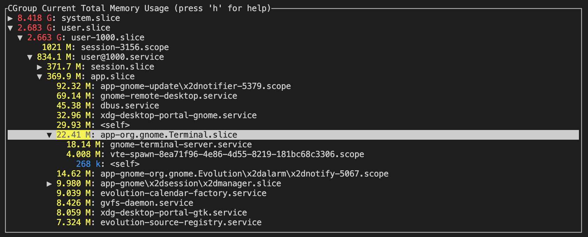

# cgroup_mem

cgroup_mem displays hierarchical memory statistics from the mounted cgroup2 filesystem.

## cgroup statistic tree

The cgroup statistics screen displays an expandable cgroup hierarchy with the selected statistic. The tree can be sorted by cgroup name or the statistic value. Processes and threads for the cgroup can be displayed by pressing 'p' or 't'. The displayed statistic can be selected by pressing 'z' or cycling through the available statistics pressing '[' and ']'.
